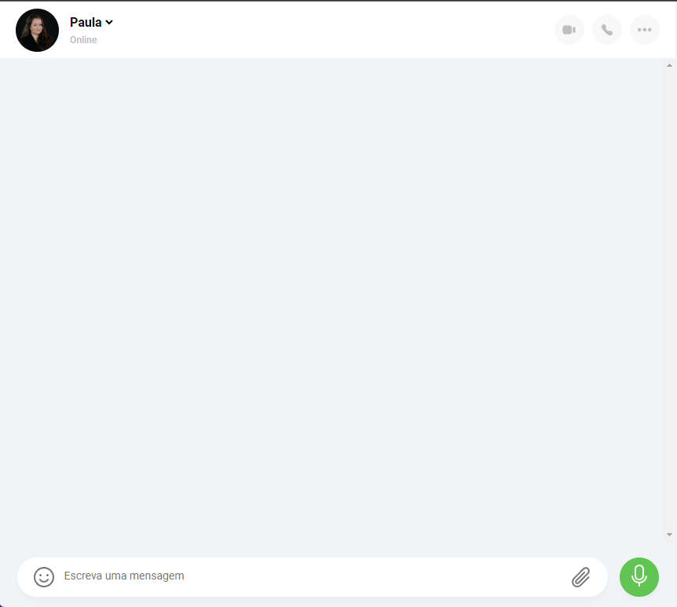

# Whatslab

Projeto de uma página inspirada no whatsapp, com opção de mudar o contato e podendo excluir mensagens com duplo clique em cima.

# Índice

* [Tecnologias usadas](#tecnologias-usadas)
* [Imagem do projeto](#imagem-do-projeto)
* [Deploy](#deploy)
* [Rodando o Projeto](#rodando-o-projeto)

## Tecnologias usadas:

- ``React.js``
- ``Next.js``
- ``Styled Components``

## Imagem do projeto:

## Deploy:

- ``Vercel`` | Link: <https://whatslab-tan.vercel.app/>

## Rodando o projeto:
- Rode o console na pasta em que você baixou os arquivos;

- Insira o comando ``npm install``;

- Depois, o comando ``npm run dev`` para rodar no navegador.

